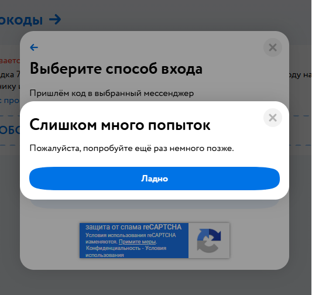

# Баг: Невозможно завершить авторизацию через Telegram (Детмир)

## Окружение
- **Браузер:** Chrome 146
- **Устройство:** ПК
- **Сайт:** detmir.ru
- **Дата:** 15.03.2026

## Предусловия
- Пользователь не авторизован
- Номер телефона привязан к аккаунту

## Шаги
1. Нажать «Профиль» → «Войти»
2. Ввести номер телефона
3. Нажать «Продолжить»
4. В окне выбора способа нажать «Код в Telegram»

## Фактический результат
- Код приходит в Telegram
- Поле для ввода кода **не появляется**
- Сразу выводится сообщение: «Слишком много попыток. Попробуйте позже.»
- Кнопка для прохождения капчи отсутствует
- Единственная доступная кнопка — «Ладно», возвращающая назад

## Ожидаемый результат
- После выбора способа должно появиться поле для ввода кода
- Пользователь должен иметь возможность ввести полученный код и авторизоваться
- Сообщение о слишком большом количестве попыток должно появляться только после нескольких неудачных вводов

## Серьёзность
🔴 **Критическая** — полностью блокирует возможность входа через Telegram

## Приоритет
⚡ **Высокий** — влияет на конверсию входа пользователей

## Дополнительно
- Баг воспроизводится стабильно
- На скриншоте видно сообщение об ошибке и отсутствие поля ввода
- Скриншот ошибки:

- 
